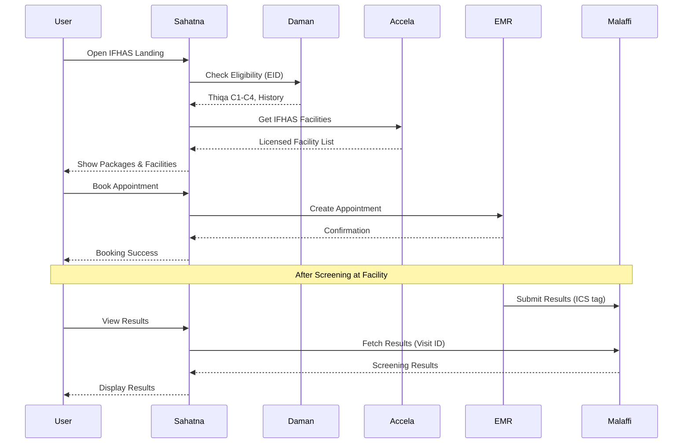

# IFHAS Application Architecture

```mermaid
flowchart TB
    subgraph Users["Users"]
        U1[("Abu Dhabi Citizens<br/>Thiqa C1-C4")]
    end

    subgraph Channels["Presentation Layer"]
        CH1[TAMM Dashboard]
        CH2[Sahatna Mobile App]
        CH3[Sahatna Web Portal]
    end

    subgraph SahatnaCore["Sahatna Core Services"]
        subgraph Identity["Identity Module"]
            ID1[Authentication Service]
            ID2[UAE Pass Integration]
        end

        subgraph Patient["Patient Module"]
            PA1[Patient Profile Service]
            PA2[Survey Service]
            PA3[Consent Management]
        end

        subgraph Provider["Provider Module"]
            PR1[Facility Service]
            PR2[Physician Service]
            PR3[Specialty Mapping]
        end

        subgraph Appointment["Appointment Module"]
            AP1[Slot Management]
            AP2[Booking Service]
            AP3[Appointment Tracker]
        end

        subgraph Integration["Integration Module"]
            IN1[Daman Adapter]
            IN2[Malaffi Adapter]
            IN3[EMR Gateway]
            IN4[Accela Adapter]
        end

        subgraph PHR["PHR Module"]
            PH1[Health Records Service]
            PH2[Screening Results]
            PH3[Encounter History]
        end

        subgraph Notification["Notification Module"]
            NO1[Push Notification Service]
            NO2[SMS Gateway]
            NO3[Email Service]
            NO4[Nudge Engine]
        end

        subgraph CMS["CMS Module"]
            CM1[Content Service]
            CM2[FAQ Management]
            CM3[Banner Management]
        end

        subgraph Batch["Batch Processing"]
            BA1[Facility Sync Job]
            BA2[Eligibility Refresh]
            BA3[Reminder Scheduler]
        end
    end

    subgraph DataLayer["Data Layer"]
        DB1[(Patient Database)]
        DB2[(Provider Database)]
        DB3[(Appointment Database)]
        DB4[(Notification Queue)]
    end

    subgraph External["External Systems"]
        EX1[Daman Insurance<br/>Eligibility & History API]
        EX2[Malaffi HIE<br/>Health Records]
        EX3[Accela Licensing<br/>Facility Registry]
        EX4[Healthcare Facility EMRs<br/>Appointment Systems]
        EX5[UAE Pass<br/>Identity Provider]
        EX6[Firebase<br/>Push Notifications]
        EX7[Strapi CMS<br/>Content Management]
    end

    %% User Flows
    U1 --> CH1
    U1 --> CH2
    U1 --> CH3

    %% Channel to Services
    CH1 & CH2 & CH3 --> ID1
    CH1 & CH2 & CH3 --> PA1
    CH1 & CH2 & CH3 --> PR1
    CH1 & CH2 & CH3 --> AP2
    CH1 & CH2 & CH3 --> PH2
    CH1 & CH2 & CH3 --> CM1

    %% Internal Service Dependencies
    ID1 --> ID2
    AP2 --> AP1
    AP2 --> PR2
    PA1 --> IN1
    PH2 --> IN2
    PR1 --> IN4
    NO1 --> NO4

    %% Data Layer Connections
    PA1 --> DB1
    PR1 --> DB2
    AP2 --> DB3
    NO1 --> DB4

    %% External Integrations
    IN1 --> EX1
    IN2 --> EX2
    IN4 --> EX3
    IN3 --> EX4
    ID2 --> EX5
    NO1 --> EX6
    CM1 --> EX7
    BA1 --> EX3

    style Users fill:#e1f5fe
    style Channels fill:#fff3e0
    style SahatnaCore fill:#e8f5e9
    style DataLayer fill:#fce4ec
    style External fill:#f3e5f5
```

## Component Descriptions

### Presentation Layer
| Component | Description |
|-----------|-------------|
| TAMM Dashboard | Government portal entry point with IFHAS banner |
| Sahatna Mobile App | Primary mobile interface for IFHAS booking |
| Sahatna Web Portal | Web-based access to IFHAS services |

### Sahatna Core Services

| Module | Service | IFHAS Function |
|--------|---------|----------------|
| **Identity** | Authentication | User login and session management |
| | UAE Pass Integration | National identity verification |
| **Patient** | Patient Profile | User demographics and preferences |
| | Survey Service | Post-appointment feedback collection |
| **Provider** | Facility Service | IFHAS facility search and details |
| | Physician Service | Doctor profiles and availability |
| | Specialty Mapping | Package-to-specialty matching |
| **Appointment** | Slot Management | Available time slot retrieval |
| | Booking Service | Appointment creation and modification |
| **Integration** | Daman Adapter | Eligibility check and IFHAS history |
| | Malaffi Adapter | Screening results retrieval |
| | EMR Gateway | Appointment sync with facilities |
| | Accela Adapter | Licensed facility list sync |
| **PHR** | Screening Results | Lab results from Malaffi |
| | Encounter History | Past IFHAS packages |
| **Notification** | Nudge Engine | Proactive engagement rules |
| | Push/SMS/Email | Multi-channel delivery |
| **CMS** | Content Service | Program information and FAQs |
| **Batch** | Facility Sync | Daily Accela sync job |
| | Reminder Scheduler | 24H/1H appointment reminders |

### External System Integrations

| System | Integration Type | Data Exchanged |
|--------|-----------------|----------------|
| **Daman** | REST API | Thiqa category, eligibility, IFHAS history |
| **Malaffi** | HL7/FHIR | Screening results, encounter data |
| **Accela** | REST API | Licensed IFHAS facility list |
| **EMR Systems** | HL7/REST | Appointment booking, slot availability |
| **UAE Pass** | OAuth 2.0 | Identity verification |
| **Firebase** | FCM | Push notifications |
| **Strapi** | REST API | CMS content, questionnaire PDF |

## Data Flow Summary

