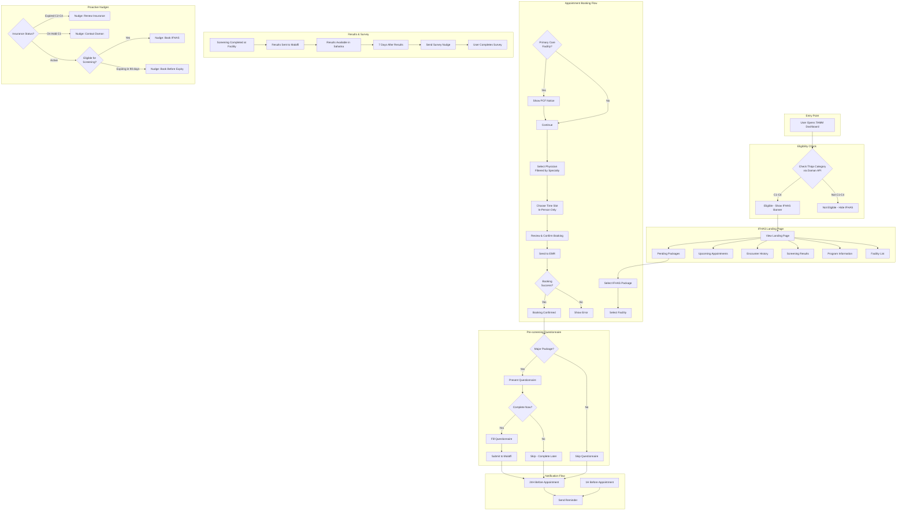

# IFHAS Process Diagram

## Process Description

### 1. Eligibility Check
- User opens TAMM Dashboard
- System checks Thiqa insurance category via Daman API
- Only C1-C4 categories are eligible for IFHAS

### 2. Landing Page
- Displays pending packages based on age/gender
- Shows upcoming appointments and history
- Provides program information and facility list

### 3. Booking Flow
- User selects package → facility → physician → time slot
- Physicians filtered by specialties required for selected package
- Only in-person appointments available
- Booking sent to facility EMR

### 4. Pre-screening Questionnaire
- Required for Major packages only
- Can be completed immediately or skipped for later
- Results submitted to Malaffi for physician access

### 5. Notifications
- Automated reminders at 24H and 1H before appointment
- Survey nudge 7 days after results available

### 6. Proactive Nudges
- Insurance renewal reminders
- Screening availability notifications
- Pre-expiry booking encouragement
