# IFHAS Use Case Sequence Diagrams

## UC1: Check User Eligibility

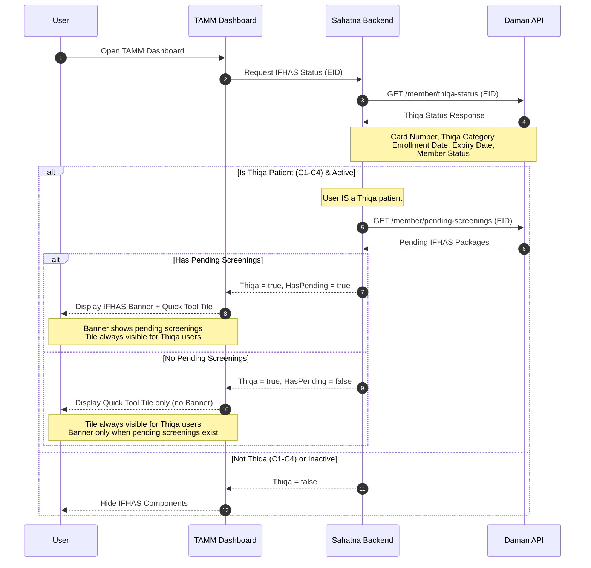

---

## UC2: View IFHAS Landing Page

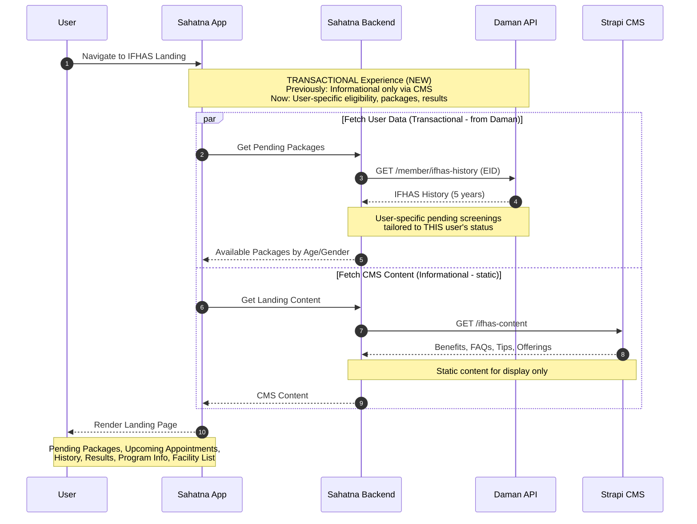

---

## UC3: Get Available IFHAS Packages

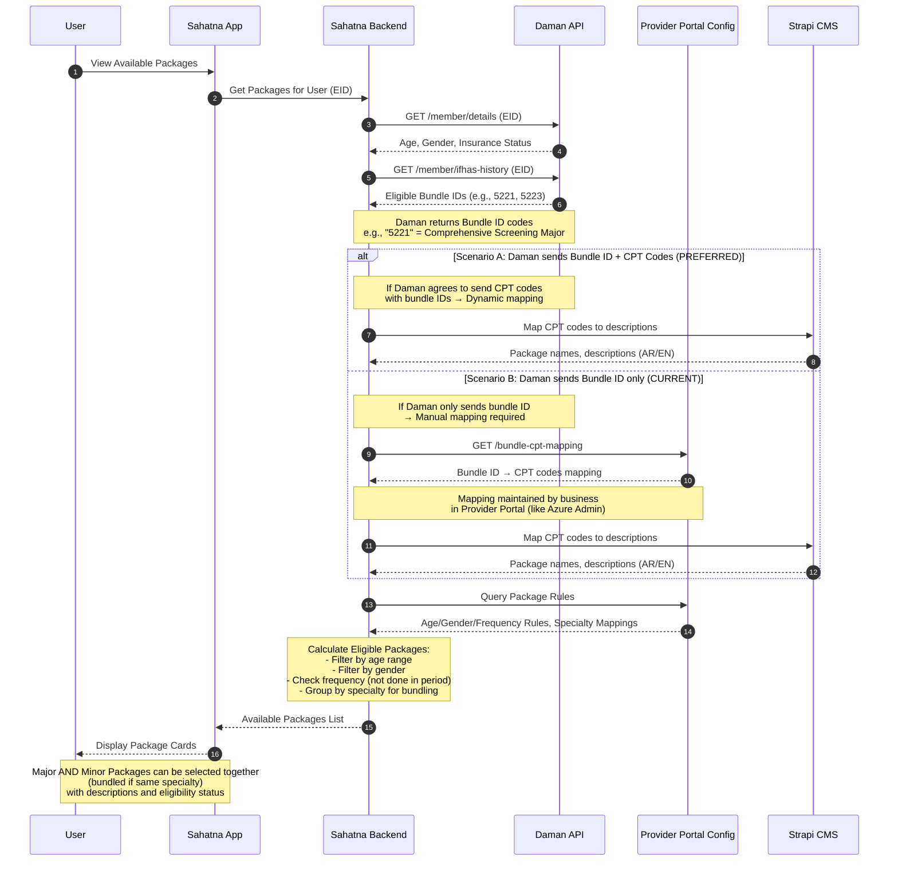

---

## UC4: View IFHAS Information & History

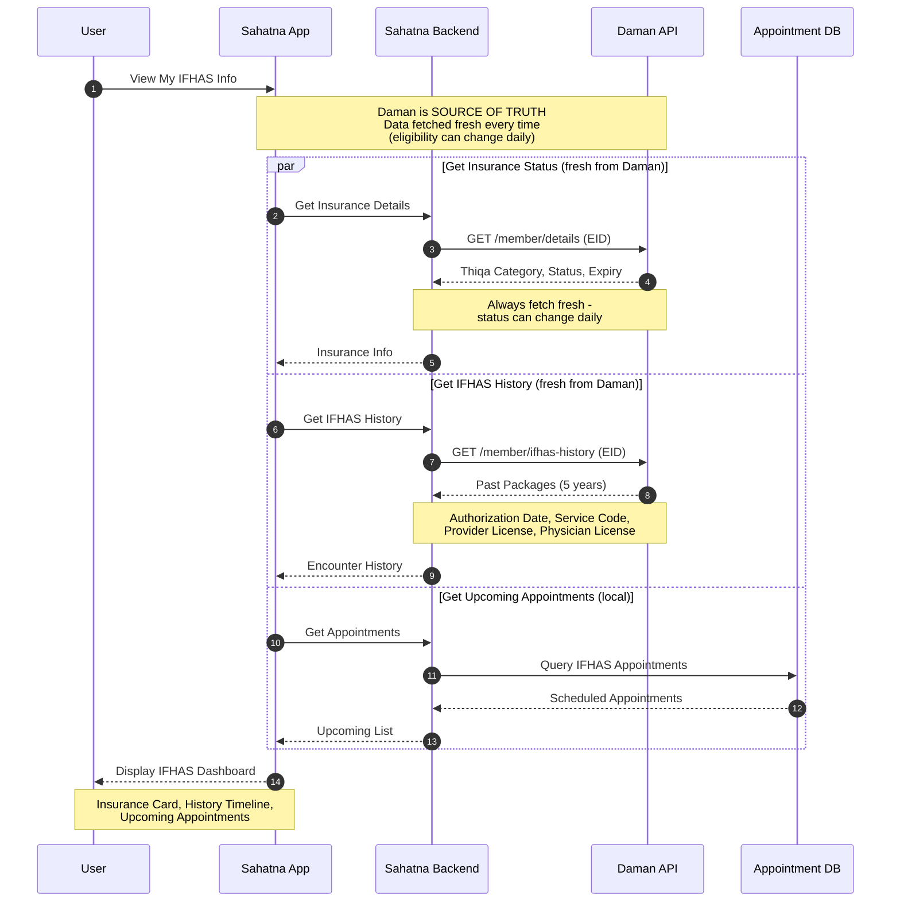

---

## UC5: View Screening Results

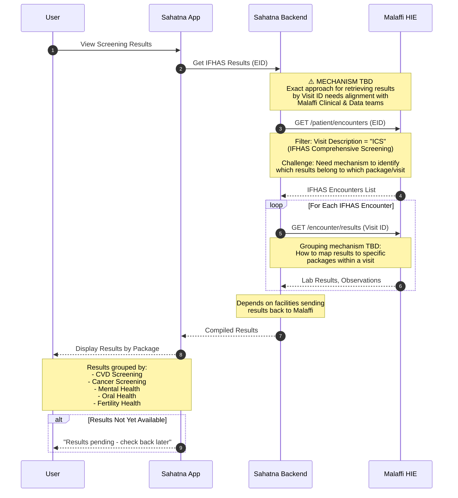

---

## UC6: Book IFHAS Appointment

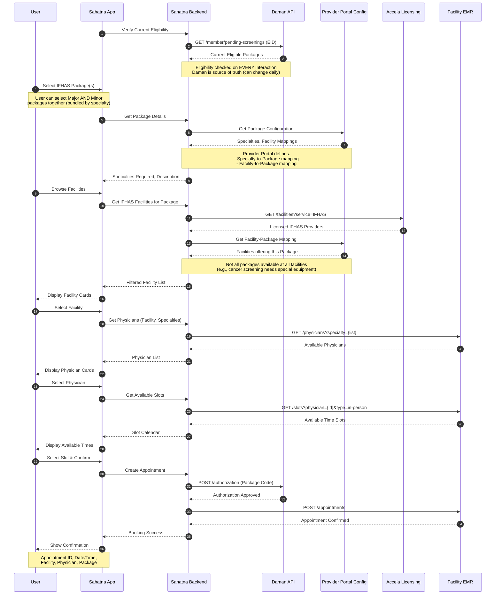

---

## UC7: Fill Pre-screening Questionnaire

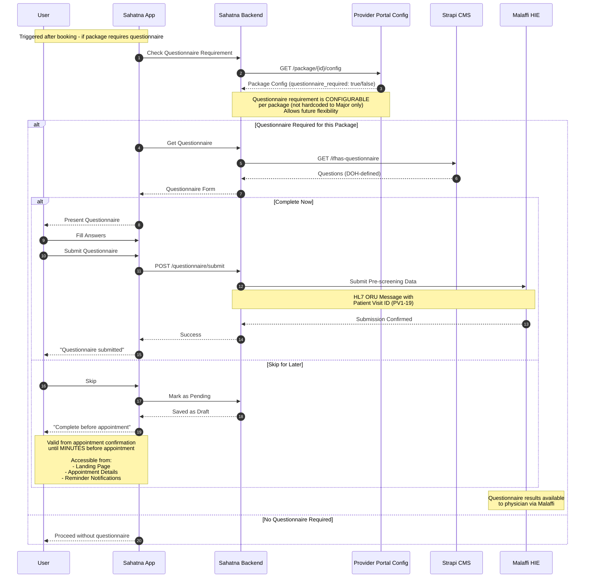

---

## UC8: View IFHAS Facility Details

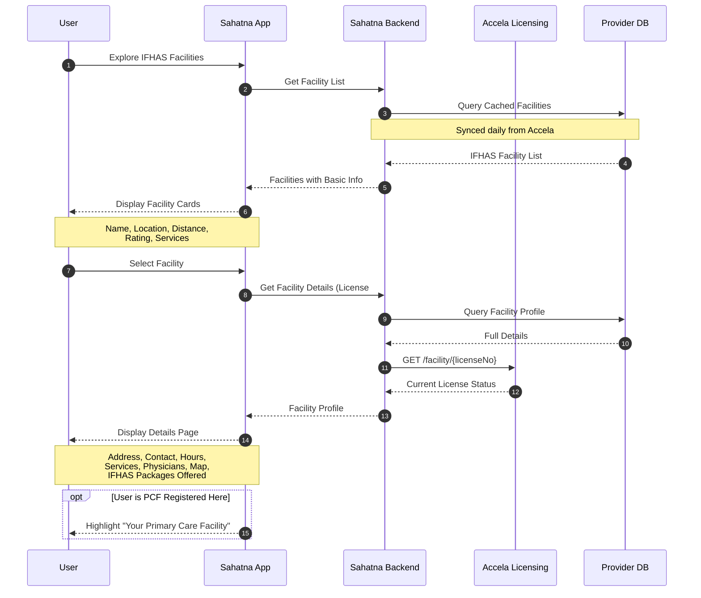

---

## UC9: Send Reminders & Nudges

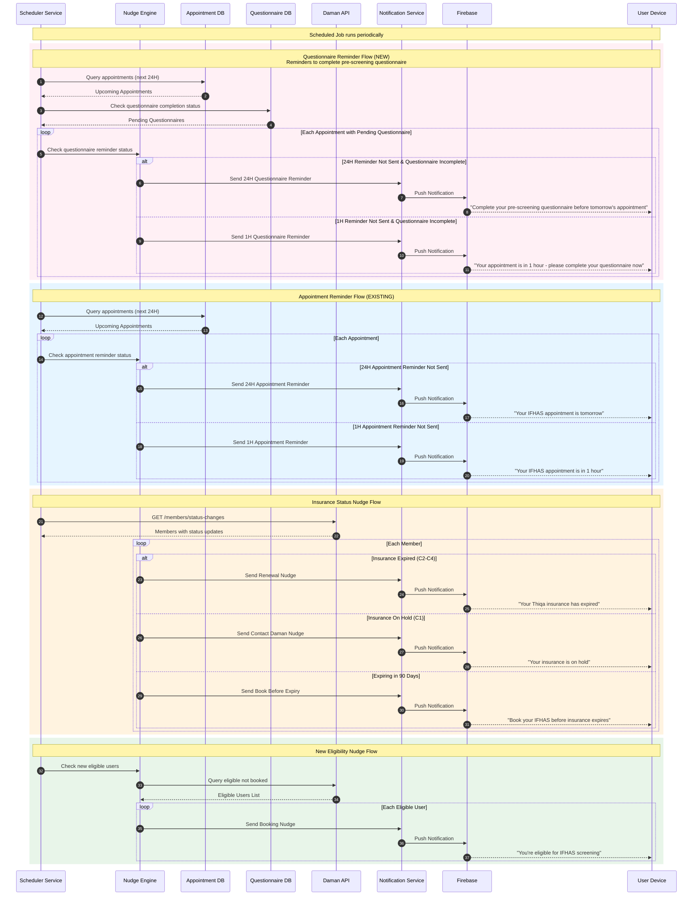

---

## UC10: Post-Appointment Survey

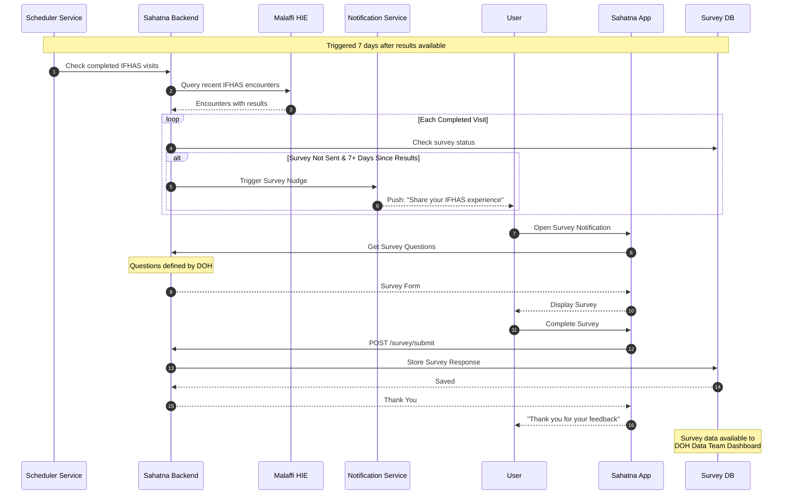

---

## End-to-End Journey: Complete IFHAS Flow

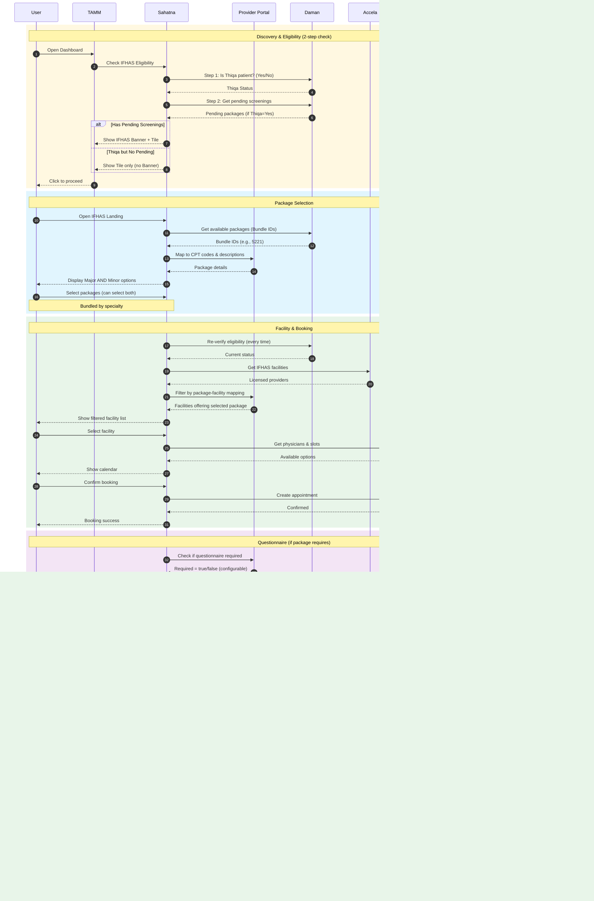

---

## Legend

| Symbol | Meaning |
|--------|---------|
| `->>`  | Synchronous request |
| `-->>` | Response |
| `par`  | Parallel execution |
| `alt`  | Alternative paths |
| `loop` | Repeated operation |
| `opt`  | Optional step |
| `rect` | Grouped steps |
| `Note` | Additional context |
