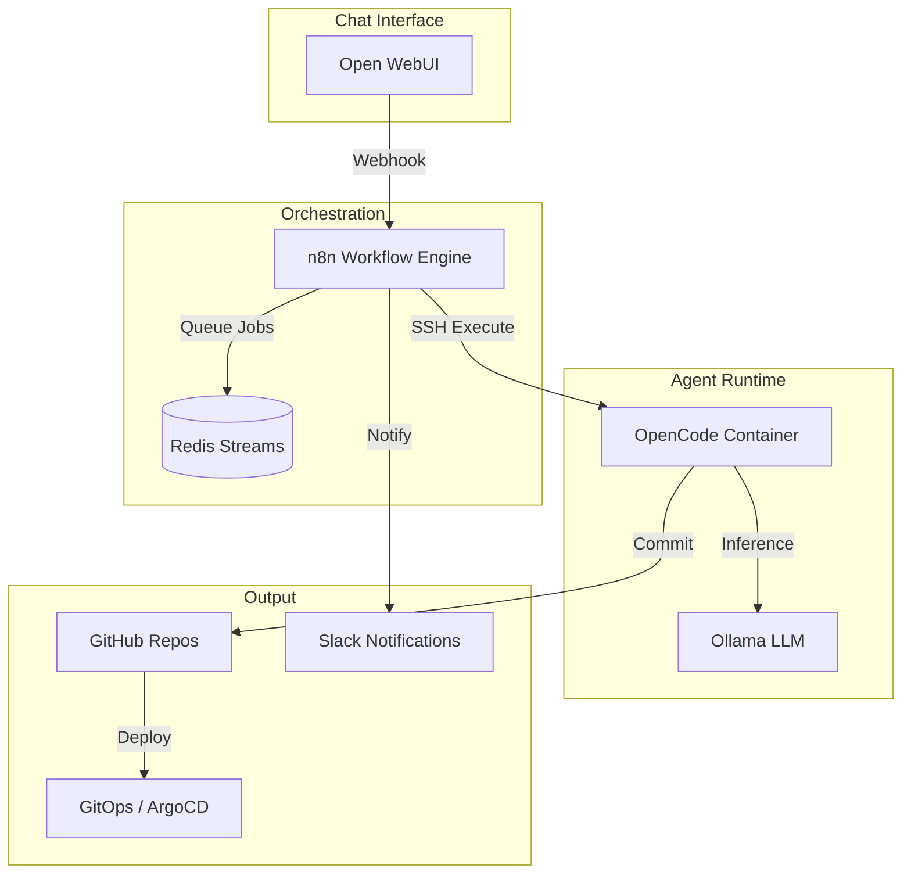
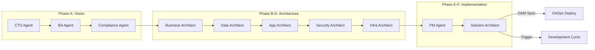
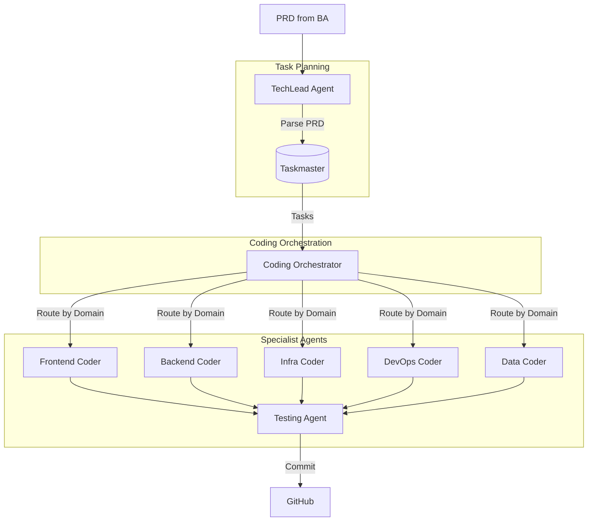
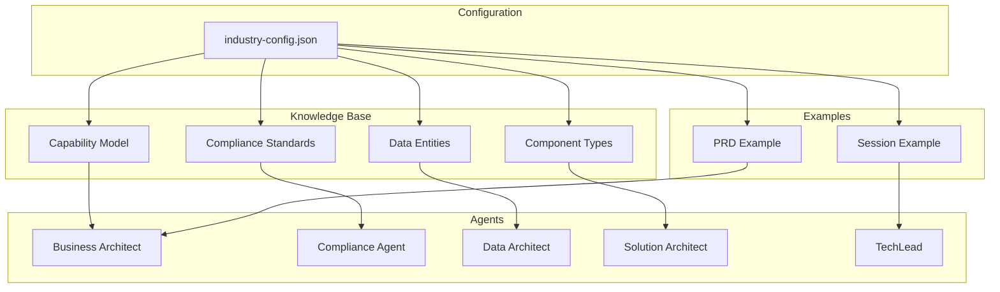
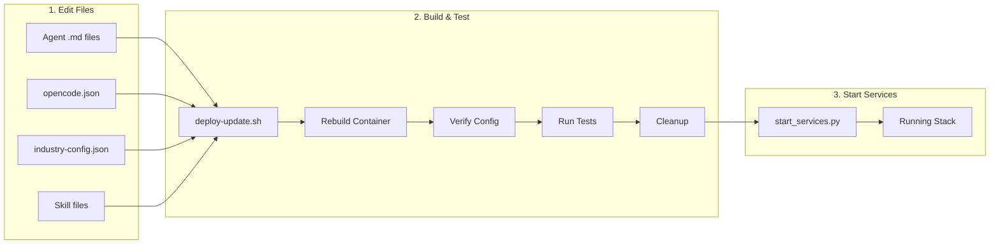
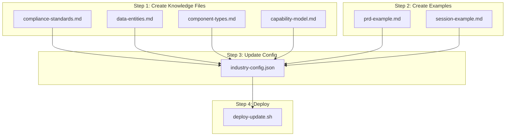

# Self-hosted AI Package

**Self-hosted AI Package** is an open, docker compose template that
quickly bootstraps a fully featured Local AI and Low Code development
environment including Ollama for your local LLMs, Open WebUI for an interface to chat with your N8N agents, and Supabase for your database, vector store, and authentication. 

This is Cole's version with a couple of improvements and the addition of Supabase, Open WebUI, Flowise, Neo4j, Langfuse, SearXNG, and Caddy!
Also, the local RAG AI Agent workflows from the video will be automatically in your 
n8n instance if you use this setup instead of the base one provided by n8n!

**IMPORANT**: Supabase has updated a couple environment variables so you may have to add some new default values in your .env that I have in my .env.example if you have had this project up and running already and are just pulling new changes. Specifically, you need to add "POOLER_DB_POOL_SIZE=5" to your .env. This is required if you have had the package running before June 14th.

## Important Links

- [Local AI community](https://thinktank.ottomator.ai/c/local-ai/18) forum over in the oTTomator Think Tank

- [GitHub Kanban board](https://github.com/users/coleam00/projects/2/views/1) for feature implementation and bug squashing.

- [Original Local AI Starter Kit](https://github.com/n8n-io/self-hosted-ai-starter-kit) by the n8n team

- Download my N8N + OpenWebUI integration [directly on the Open WebUI site.](https://openwebui.com/f/coleam/n8n_pipe/) (more instructions below)


Curated by <https://github.com/n8n-io> and <https://github.com/coleam00>, it combines the self-hosted n8n
platform with a curated list of compatible AI products and components to
quickly get started with building self-hosted AI workflows.

### What’s included

✅ [**Self-hosted n8n**](https://n8n.io/) - Low-code platform with over 400
integrations and advanced AI components

✅ [**Supabase**](https://supabase.com/) - Open source database as a service -
most widely used database for AI agents

✅ [**Ollama**](https://ollama.com/) - Cross-platform LLM platform to install
and run the latest local LLMs

✅ [**Open WebUI**](https://openwebui.com/) - ChatGPT-like interface to
privately interact with your local models and N8N agents

✅ [**Flowise**](https://flowiseai.com/) - No/low code AI agent
builder that pairs very well with n8n

✅ [**Qdrant**](https://qdrant.tech/) - Open source, high performance vector
store with an comprehensive API. Even though you can use Supabase for RAG, this was
kept unlike Postgres since it's faster than Supabase so sometimes is the better option.

✅ [**Neo4j**](https://neo4j.com/) - Knowledge graph engine that powers tools like GraphRAG, LightRAG, and Graphiti 

✅ [**SearXNG**](https://searxng.org/) - Open source, free internet metasearch engine which aggregates 
results from up to 229 search services. Users are neither tracked nor profiled, hence the fit with the local AI package.

✅ [**Caddy**](https://caddyserver.com/) - Managed HTTPS/TLS for custom domains

✅ [**Langfuse**](https://langfuse.com/) - Open source LLM engineering platform for agent observability

✅ [**OpenCode Agents**](https://opencode.ai/) - Multi-agent architecture for enterprise architecture and development workflows

---

## OpenCode Agent System

The package includes a sophisticated multi-agent system for enterprise architecture (ADM cycle) and software development workflows. The agents run in a containerized OpenCode instance connected to Ollama for local LLM inference.

### Architecture Overview



### Agent Workflow Cycles

The system operates in two distinct cycles:

#### ADM Cycle (Architecture Decision Making)

Enterprise architecture workflow following TOGAF ADM phases:



#### Development Cycle (Code Implementation)

Task-driven development workflow:



### Industry Configuration System

The agent system supports industry-specific knowledge through a configurable system:



#### Current Industry: Healthcare

The default configuration is for healthcare providers with:

| Knowledge Type | Content |
|---------------|---------|
| Capability Model | 1,666 healthcare capabilities (Patient Care, Clinical Ops, etc.) |
| Compliance Standards | HIPAA, HITECH, GDPR, SOC2, ISO 27001 |
| Data Entities | HL7 FHIR R4 resources (Patient, Encounter, Observation, etc.) |
| Component Types | EHR, PMS, Patient Portal, Telehealth, etc. |

#### Switching Industries

To configure for a different industry (e.g., banking):

1. Create knowledge files in `opencode/.opencode/knowledge/{industry}/`
2. Update `opencode/industry-config.json`:

```json
{
  "industry": "banking",
  "displayName": "Banking & Financial Services",
  "agentKnowledge": {
    "compliance": {
      "standards": ["PSD2", "Basel III", "GLBA", "SOX"],
      "primaryStandard": "PSD2"
    },
    "data-architect": {
      "standards": ["ISO 20022", "SWIFT", "FIX Protocol"]
    }
  }
}
```

3. Rebuild the container: `./deploy-update.sh --build-only`

### OpenCode Deployment Scripts

#### deploy-update.sh

Build and test OpenCode agents, then clean up for `start_services.py`:

sequence: run deploy, without stoping current, then run;

```
docker compose -p localai --profile gpu-nvidia up -d --build --force-recreate opencode-gpu
```

```bash
# Full deploy: build, test, cleanup (default)
./deploy-update.sh

# Build only (fastest - no test, no start)
./deploy-update.sh --build-only

# Full deploy but leave containers running
./deploy-update.sh --keep-running

# Show help
./deploy-update.sh --help
```

| Option | Description |
|--------|-------------|
| `(default)` | Full deploy → test → cleanup containers |
| `--build-only` | Pull → build only (no start, no test) |
| `--rebuild-only` | Rebuild → verify → cleanup |
| `--no-test` | Full deploy → verify → cleanup (skip test) |
| `--keep-running` | Full deploy → test → leave running |
| `--test-only` | Run quick test only |
| `--pull-only` | Git pull and show changes |

#### test-agents.sh

Test agent functionality and industry configuration:

```bash
# Full test suite (all 21 agents + industry tests)
./test-agents.sh

# Quick connectivity test
./test-agents.sh --quick

# Verify industry configuration only
./test-agents.sh --config

# Test industry-specific knowledge
./test-agents.sh --industry
```

### Agent List

| Category | Agent | Purpose |
|----------|-------|---------|
| **Orchestrators** | architect-orchestrator | ADM workflow coordinator |
| | coding-orchestrator | Development cycle coordinator |
| **ADM Cycle** | cto | Strategic technology decisions |
| | ba-agent | Requirements and PRD |
| | compliance | Regulatory assessment |
| | business-architect | Capability mapping |
| | data-architect | Data modeling |
| | app-architect | Application design |
| | security-architect | Security controls |
| | infra-architect | Infrastructure design |
| | pm | Project planning |
| | solution-architect | OAM deployment specs |
| **Dev Cycle** | techlead | PRD to tasks breakdown |
| | frontend-coder | React, Vue, CSS |
| | backend-coder | APIs, services |
| | infra-coder | Kubernetes, Terraform |
| | devops-coder | CI/CD, Docker |
| | data-coder | SQL, migrations |
| | testing-agent | Unit/integration tests |
| **Utility** | general | General assistance |
| | comedian | Programming jokes |

### Updating OpenCode Container

When you make changes to agent instructions, skills, or configuration files, follow this workflow:



#### Quick Update Workflow

```bash
# 1. Make your changes to files in opencode/ directory
#    - opencode/.opencode/agent/*.md      (agent instructions)
#    - opencode/.opencode/skills/*/       (skills and references)
#    - opencode/opencode.json             (agent configuration)
#    - opencode/industry-config.json      (industry knowledge paths)

# 2. Build and test (containers cleaned up after)
./deploy-update.sh

# 3. Start all services
python start_services.py --profile gpu-nvidia
```

#### Development Workflow (Keep Running)

For iterative development where you want to test agents interactively:

```bash
# Build and keep containers running
./deploy-update.sh --keep-running

# Test agents manually
docker exec -it opencode opencode run --agent general "Hello"
docker exec -it opencode opencode run --agent compliance "What is HIPAA?"

# Run full test suite
./test-agents.sh

# When done, clean up manually
docker stop opencode ollama && docker rm opencode ollama

# Then start via services script
python start_services.py --profile gpu-nvidia
```

#### Testing Industry Configuration

```bash
# Verify configuration is loaded correctly
./test-agents.sh --config

# Test industry-specific agent knowledge
./test-agents.sh --industry

# Full test suite (includes industry tests)
./test-agents.sh
```

#### Troubleshooting

```bash
# Check container logs
docker logs opencode --tail 50
docker logs ollama --tail 50

# Interactive shell in container
docker exec -it opencode /bin/sh

# Verify files are in container
docker exec -it opencode ls -la /root/.config/opencode/
docker exec -it opencode cat /root/.config/opencode/industry-config.json

# Check Ollama model
docker exec -it ollama ollama list
```

### Extending for Different Industries

To adapt the agent system for a new industry, follow this guide:



#### Step 1: Create Knowledge Directory

```bash
# Create industry-specific knowledge directory
mkdir -p opencode/.opencode/knowledge/{industry}/

# Example for banking
mkdir -p opencode/.opencode/knowledge/banking/
```

#### Step 2: Create Knowledge Files

Each file provides domain expertise for specific agents:

| File | Used By | Content |
|------|---------|---------|
| `compliance-standards.md` | Compliance Agent | Regulatory requirements (e.g., PSD2, Basel III) |
| `data-entities.md` | Data Architect | Domain data model (e.g., Account, Transaction) |
| `component-types.md` | Solution Architect | System types (e.g., Core Banking, Payment Gateway) |

**Example: `opencode/.opencode/knowledge/banking/compliance-standards.md`**

```markdown
# Banking Compliance Standards

## Primary Standards

### PSD2 (Payment Services Directive 2)
**Scope**: Payment services in the European Economic Area
**Key Requirements**:
- Strong Customer Authentication (SCA)
- Open Banking APIs (XS2A)
- Transaction monitoring
...

### Basel III
**Scope**: Banking capital requirements
**Key Requirements**:
- Capital adequacy ratios
- Liquidity coverage ratio
- Net stable funding ratio
...
```

**Example: `opencode/.opencode/knowledge/banking/data-entities.md`**

```markdown
# Banking Data Entities

## Core Entities

### Account
**Key Attributes**:
- `accountNumber`: Unique identifier
- `accountType`: Checking, Savings, Loan
- `currency`: ISO 4217 code
- `balance`: Current balance
- `status`: Active, Dormant, Closed

### Transaction
**Key Attributes**:
- `transactionId`: Unique identifier
- `type`: Credit, Debit, Transfer
- `amount`: Transaction amount
- `timestamp`: ISO 8601 datetime
- `status`: Pending, Completed, Failed
...
```

#### Step 3: Create Example Files

```bash
# Create examples directory (if not exists)
mkdir -p opencode/.opencode/examples/
```

**Example: `opencode/.opencode/examples/banking-prd-example.md`**

```markdown
# Product Requirements Document: Mobile Banking App

## 1. Overview

### Problem Statement
Bank customers need secure, convenient access to accounts and transactions
from mobile devices with real-time notifications and easy transfers.

### Target Audience
- Primary: Retail banking customers aged 18-65
- Secondary: Small business owners managing accounts
...
```

#### Step 4: Create/Update Capability Model (Optional)

For business architect support, create an industry capability model:

```bash
# Place in skills references
opencode/.opencode/skills/adoit-archimate/references/banking-capability-model.md
```

#### Step 5: Update industry-config.json

```json
{
  "$schema": "./industry-config.schema.json",
  "industry": "banking",
  "displayName": "Banking & Financial Services",
  "description": "Configuration for banking and financial services architecture",

  "knowledgeBase": {
    "capabilityModel": ".opencode/skills/adoit-archimate/references/banking-capability-model.md",
    "complianceStandards": ".opencode/knowledge/banking/compliance-standards.md",
    "dataEntities": ".opencode/knowledge/banking/data-entities.md",
    "componentTypes": ".opencode/knowledge/banking/component-types.md",
    "prdExample": ".opencode/examples/banking-prd-example.md",
    "sessionExample": ".opencode/examples/banking-session-example.md"
  },

  "agentKnowledge": {
    "compliance": {
      "standards": ["PSD2", "Basel III", "GLBA", "SOX", "GDPR"],
      "referenceFile": ".opencode/knowledge/banking/compliance-standards.md",
      "primaryStandard": "PSD2"
    },
    "business-architect": {
      "capabilityModel": ".opencode/skills/adoit-archimate/references/banking-capability-model.md",
      "domainFocus": ["Retail Banking", "Corporate Banking", "Payments", "Risk Management"]
    },
    "data-architect": {
      "entities": ".opencode/knowledge/banking/data-entities.md",
      "standards": ["ISO 20022", "SWIFT MT/MX", "FIX Protocol", "BIAN"],
      "primaryDataModel": "ISO 20022"
    },
    "solution-architect": {
      "componentTypes": ".opencode/knowledge/banking/component-types.md",
      "integrationPatterns": ["Core Banking", "Payment Gateway", "Card Management", "AML/KYC"]
    },
    "techlead": {
      "sessionExample": ".opencode/examples/banking-session-example.md"
    },
    "ba-agent": {
      "prdExample": ".opencode/examples/banking-prd-example.md"
    }
  },

  "infrastructure": {
    "slackChannel": "YOUR_SLACK_CHANNEL_ID",
    "githubOrg": "your-banking-org",
    "sshCredential": "gpuServerSsh"
  }
}
```

#### Step 6: Deploy and Test

```bash
# Rebuild with new industry config
./deploy-update.sh --build-only

# Start services
python start_services.py --profile gpu-nvidia

# Verify industry is loaded
./test-agents.sh --config

# Test industry-specific knowledge
./test-agents.sh --industry
```

#### Industry Extension Checklist

- [ ] Create `knowledge/{industry}/compliance-standards.md`
- [ ] Create `knowledge/{industry}/data-entities.md`
- [ ] Create `knowledge/{industry}/component-types.md`
- [ ] Create `examples/{industry}-prd-example.md`
- [ ] Create `examples/{industry}-session-example.md`
- [ ] (Optional) Create capability model in `skills/adoit-archimate/references/`
- [ ] Update `industry-config.json` with all paths
- [ ] Run `./deploy-update.sh --build-only`
- [ ] Verify with `./test-agents.sh --config`

#### Pre-built Industry Templates

| Industry | Status | Key Standards |
|----------|--------|---------------|
| Healthcare | ✅ Included | HIPAA, HL7 FHIR, ICD-10 |
| Banking | 📋 Template | PSD2, ISO 20022, Basel III |
| Retail | 📋 Template | PCI-DSS, EDI, GS1 |
| Manufacturing | 📋 Template | ISO 9001, OPC-UA, ISA-95 |

---

## n8n Architecture Pipeline

The package includes a pre-built n8n workflow for automated enterprise architecture generation using AI agents and a Qdrant knowledge base.

### Workflow Overview

```
┌──────────────┐     ┌─────────────┐     ┌───────────────────┐     ┌──────────────┐
│   Webhook    │────►│  BRD Agent  │────►│ Business Arch     │────►│   Response   │
│   Trigger    │     │  (Phase 1)  │     │ Agent (Phase 2)   │     │   Output     │
└──────────────┘     └─────────────┘     └───────────────────┘     └──────────────┘
                           │                       │
                           ▼                       ▼
                    ┌─────────────┐         ┌─────────────────┐
                    │ Ollama LLM  │         │ Capability QA   │◄── Qdrant Vector Store
                    │ + Think Tool│         │ Tool + LLM      │◄── Healthcare Capabilities
                    └─────────────┘         └─────────────────┘
```

### Workflows Included

| Workflow | ID | Purpose |
|----------|------|---------|
| Architecture Pipeline - AI Agent with Ollama | `iKBlJTWf5HPkKAVX` | Main BRD + Business Architecture generation |
| Knowledge Loader - Generic | `BlN67oV6QwF2hzgb` | Load any knowledge folder into its Qdrant collection |
| Knowledge Loader - All Collections | `hW4tlUp7CC0BItkN` | Batch load all knowledge folders |

### Knowledge Folder Structure

The package includes a structured knowledge base system for AI agents. Knowledge files are organized by domain and automatically loaded into Qdrant vector store collections.

#### Folder Structure

```
shared/knowledge/
├── knowledge-config.json          # Configuration mapping folders to collections
├── capability-maps/               # Business capability models
│   ├── README.md
│   └── capability_map_documents.json
├── reference-architectures/       # Architecture patterns & templates
├── guardrails-principles/         # ADRs, constraints, policies
├── existing-landscape/            # Current system documentation
├── compliance-requirements/       # HIPAA, GDPR, SOC2 docs
├── data-standards/                # Data models, naming conventions
├── security-standards/            # Security policies, threat models
└── testing-standards/             # QA methodologies, test strategies
```

#### Collection-to-Agent Mapping

| Collection | Qdrant Collection | Used By Agents |
|------------|-------------------|----------------|
| capability-maps | `capability-maps` | business-architect |
| reference-architectures | `reference-architectures` | app-architect, solution-architect, infra-architect |
| guardrails-principles | `guardrails-principles` | app-architect, security-architect, compliance, risk-analyst |
| existing-landscape | `existing-landscape` | All architect agents |
| compliance-requirements | `compliance-requirements` | compliance, security-architect, risk-analyst |
| data-standards | `data-standards` | data-architect, solution-architect |
| security-standards | `security-standards` | security-architect, infra-architect |
| testing-standards | `testing-standards` | qa-architect, testing-agent |

#### Loading Knowledge

**Option 1: Load a single collection**
```bash
# Via webhook (replace collection name as needed)
curl -X POST http://localhost:5678/webhook/knowledge-loader \
  -H "Content-Type: application/json" \
  -d '{"collection": "capability-maps"}'
```

**Option 2: Load all collections**
1. Open **"Knowledge Loader - All Collections"** workflow in n8n
2. Click **"Execute Workflow"** (manual trigger)
3. Wait for all collections to be embedded and loaded

#### Adding New Knowledge

1. Add files to the appropriate `shared/knowledge/<folder>/` directory
2. Supported formats: `.json`, `.md`, `.txt`, `.yaml`, `.sql`
3. Run the Knowledge Loader workflow for that collection
4. The generic loader will automatically process and embed the files

### Setting Up Qdrant Knowledge Base

The Business Architecture Agent uses a Qdrant vector store containing the Healthcare Capability Reference Model (1,666 capabilities across L1-L4 levels). This enables the agent to map business requirements to standard healthcare capabilities.

#### Step 1: Verify Qdrant is Running

```bash
# Check Qdrant container status
docker ps | grep qdrant

# Test Qdrant API connectivity
curl http://localhost:6333/collections
```

#### Step 2: Verify Capability Data File

The capability map JSON should exist at `shared/knowledge/capability-maps/capability_map_documents.json`:

```bash
# Check file exists (should be ~1.2MB with 1,666 capabilities)
ls -la shared/knowledge/capability-maps/capability_map_documents.json

# Preview the data structure
head -c 500 shared/knowledge/capability-maps/capability_map_documents.json
```

If the file doesn't exist, it can be regenerated from the source Excel file:

```bash
# Generate from Excel (requires pandas, openpyxl)
cd opencode/scripts
python -c "
import pandas as pd
import json

df = pd.read_excel('../../chealth_apability_map.xlsx', sheet_name='Capability Map')
documents = []
for idx, row in df.iterrows():
    level = int(row['Level']) if pd.notna(row['Level']) else 1
    cap = str(row['Capability']) if pd.notna(row['Capability']) else ''
    definition = str(row['Definition']) if pd.notna(row['Definition']) else ''
    documents.append({
        'id': f'cap-{idx+1}',
        'level': level,
        'capability': cap,
        'text': f'Healthcare Capability L{level}: {cap}\nDefinition: {definition}',
        'metadata': {'level': level, 'l1': cap if level == 1 else '', 'capability': cap}
    })

with open('../../shared/knowledge/capability-maps/capability_map_documents.json', 'w') as f:
    json.dump(documents, f, indent=2)
print(f'Exported {len(documents)} capabilities')
"
```

#### Step 3: Configure n8n Credentials

1. Open n8n at https://n8n.socrates-hlapolosa.org (or http://localhost:5678)
2. Go to **Credentials** and ensure these exist:

| Credential | Configuration |
|------------|---------------|
| Ollama account | Base URL: `http://ollama:11434` |
| QdrantApi account | URL: `http://qdrant:6333`, API Key: (any value) |

#### Step 4: Load Capabilities into Qdrant

1. Open the **"Knowledge Loader - Generic"** workflow in n8n
2. Trigger via webhook with the collection name:
   ```bash
   curl -X POST http://localhost:5678/webhook/knowledge-loader \
     -H "Content-Type: application/json" \
     -d '{"collection": "capability-maps"}'
   ```
3. Wait for completion - this embeds all capabilities using `nomic-embed-text`

The workflow:
- Reads `/data/shared/knowledge/capability-maps/capability_map_documents.json`
- Creates embeddings using Ollama's `nomic-embed-text` model
- Inserts into Qdrant collection `capability-maps`

#### Step 5: Verify Qdrant Collection

```bash
# Check the collection was created
curl http://localhost:6333/collections/capability-maps

# Check document count
curl http://localhost:6333/collections/capability-maps | jq '.result.points_count'
```

### Testing the Architecture Pipeline

Once Qdrant is populated, test the main workflow:

```bash
# Trigger the pipeline with sample requirements
curl -X POST https://n8n.socrates-hlapolosa.org/webhook/architecture-pipeline \
  -H "Content-Type: application/json" \
  -d '{
    "requirements": "Build a patient portal for a healthcare company that allows patients to view their medical records, book appointments, and communicate with healthcare providers. Must be HIPAA compliant.",
    "projectName": "Healthcare Patient Portal"
  }'
```

Expected output includes:
- **BRD**: Business Requirements Document as JSON
- **Business Architecture**: ArchiMate Business Layer model with `capabilityMapping` fields referencing the Healthcare Capability Reference Model

### Workflow Architecture Details

#### BRD Agent (Phase 1)
- Model: `llama3.1:8b-instruct-q4_K_M`
- Tools: Think Tool (reasoning)
- Output: Structured BRD JSON

#### Business Arch Agent (Phase 2)
- Model: `llama3.1:8b-instruct-q4_K_M`
- Tools: Think Tool, Capability QA Tool (Qdrant)
- Output: ArchiMate Business Layer JSON with capability mappings

#### Capability QA Tool
- Vector Store: Qdrant (`capability-maps` collection)
- Embeddings: `nomic-embed-text` via Ollama
- Top K: 5 results per query
- Purpose: Map business functions to standard healthcare capabilities

### Troubleshooting

| Issue | Solution |
|-------|----------|
| "Read Capability JSON" returns 0 items | Verify file exists at `shared/knowledge/capability-maps/capability_map_documents.json` |
| Qdrant connection failed | Check credentials: URL should be `http://qdrant:6333` |
| Embeddings timeout | Ensure Ollama has `nomic-embed-text` model: `docker exec ollama ollama pull nomic-embed-text` |
| Capability QA Tool not responding | Verify Qdrant collection exists and has documents |
| Agent not using capability mappings | Check the Business Arch Agent system prompt includes the capability reference model |

### Loading Full Capability Map

The **"Knowledge Loader - Generic"** workflow automatically processes all documents in the knowledge folder without limits. To load all 1,666 healthcare capabilities:

```bash
curl -X POST http://localhost:5678/webhook/knowledge-loader \
  -H "Content-Type: application/json" \
  -d '{"collection": "capability-maps"}'
```

This will process all documents and create embeddings using Ollama's `nomic-embed-text` model.

---

## Prerequisites

Before you begin, make sure you have the following software installed:

- [Python](https://www.python.org/downloads/) - Required to run the setup script
- [Git/GitHub Desktop](https://desktop.github.com/) - For easy repository management
- [Docker/Docker Desktop](https://www.docker.com/products/docker-desktop/) - Required to run all services

## Installation

Clone the repository and navigate to the project directory:
```bash
export GITHUB_PAT=""
git clone https://$GITHUB_PAT@github.com/shlapolosa/local-ai-packaged.git
cd local-ai-packaged
```

Before running the services, you need to set up your environment variables for Supabase following their [self-hosting guide](https://supabase.com/docs/guides/self-hosting/docker#securing-your-services).

1. Make a copy of `.env.example` and rename it to `.env` in the root directory of the project
2. Set the following required environment variables:
   ```bash
   ############
   # N8N Configuration
   ############
   N8N_ENCRYPTION_KEY=
   N8N_USER_MANAGEMENT_JWT_SECRET=

   ############
   # Supabase Secrets
   ############
   POSTGRES_PASSWORD=
   JWT_SECRET=
   ANON_KEY=
   SERVICE_ROLE_KEY=
   DASHBOARD_USERNAME=
   DASHBOARD_PASSWORD=
   POOLER_TENANT_ID=

   ############
   # Neo4j Secrets
   ############   
   NEO4J_AUTH=

   ############
   # Langfuse credentials
   ############

   CLICKHOUSE_PASSWORD=
   MINIO_ROOT_PASSWORD=
   LANGFUSE_SALT=
   NEXTAUTH_SECRET=
   ENCRYPTION_KEY=  
   ```

> [!IMPORTANT]
> Make sure to generate secure random values for all secrets. Never use the example values in production.

3. Set the following environment variables if deploying to production, otherwise leave commented:
   ```bash
   ############
   # Caddy Config
   ############

   N8N_HOSTNAME=n8n.yourdomain.com
   WEBUI_HOSTNAME=:openwebui.yourdomain.com
   FLOWISE_HOSTNAME=:flowise.yourdomain.com
   SUPABASE_HOSTNAME=:supabase.yourdomain.com
   OLLAMA_HOSTNAME=:ollama.yourdomain.com
   SEARXNG_HOSTNAME=searxng.yourdomain.com
   NEO4J_HOSTNAME=neo4j.yourdomain.com
   LETSENCRYPT_EMAIL=your-email-address
   ```   

---

The project includes a `start_services.py` script that handles starting both the Supabase and local AI services. The script accepts a `--profile` flag to specify which GPU configuration to use.

### For Nvidia GPU users

```bash
python start_services.py --profile gpu-nvidia
```

> [!NOTE]
> If you have not used your Nvidia GPU with Docker before, please follow the
> [Ollama Docker instructions](https://github.com/ollama/ollama/blob/main/docs/docker.md).

### For AMD GPU users on Linux

```bash
python start_services.py --profile gpu-amd
```

### For Mac / Apple Silicon users

If you're using a Mac with an M1 or newer processor, you can't expose your GPU to the Docker instance, unfortunately. There are two options in this case:

1. Run the starter kit fully on CPU:
   ```bash
   python start_services.py --profile cpu
   ```

2. Run Ollama on your Mac for faster inference, and connect to that from the n8n instance:
   ```bash
   python start_services.py --profile none
   ```

   If you want to run Ollama on your mac, check the [Ollama homepage](https://ollama.com/) for installation instructions.

#### For Mac users running OLLAMA locally

If you're running OLLAMA locally on your Mac (not in Docker), you need to modify the OLLAMA_HOST environment variable in the n8n service configuration. Update the x-n8n section in your Docker Compose file as follows:

```yaml
x-n8n: &service-n8n
  # ... other configurations ...
  environment:
    # ... other environment variables ...
    - OLLAMA_HOST=host.docker.internal:11434
```

Additionally, after you see "Editor is now accessible via: http://localhost:5678/":

1. Head to http://localhost:5678/home/credentials
2. Click on "Local Ollama service"
3. Change the base URL to "http://host.docker.internal:11434/"

### For everyone else

```bash
python start_services.py --profile cpu
```

### The environment argument
The **start-services.py** script offers the possibility to pass one of two options for the environment argument, **private** (default environment) and **public**:
- **private:** you are deploying the stack in a safe environment, hence a lot of ports can be made accessible without having to worry about security
- **public:** the stack is deployed in a public environment, which means the attack surface should be made as small as possible. All ports except for 80 and 443 are closed

The stack initialized with
```bash
   python start_services.py --profile gpu-nvidia --environment private
   ```
equals the one initialized with
```bash
   python start_services.py --profile gpu-nvidia
   ```

## Deploying to the Cloud

### Prerequisites for the below steps

- Linux machine (preferably Unbuntu) with Nano, Git, and Docker installed

### Extra steps

Before running the above commands to pull the repo and install everything:

1. Run the commands as root to open up the necessary ports:
   - ufw enable
   - ufw allow 80 && ufw allow 443
   - ufw reload
   ---
   **WARNING**

   ufw does not shield ports published by docker, because the iptables rules configured by docker are analyzed before those configured by ufw. There is a solution to change this behavior, but that is out of scope for this project. Just make sure that all traffic runs through the caddy service via port 443. Port 80 should only be used to redirect to port 443.

   ---
2. Run the **start-services.py** script with the environment argument **public** to indicate you are going to run the package in a public environment. The script will make sure that all ports, except for 80 and 443, are closed down, e.g.

```bash
   python3 start_services.py --profile gpu-nvidia --environment public
   ```

3. Set up A records for your DNS provider to point your subdomains you'll set up in the .env file for Caddy
to the IP address of your cloud instance.

   For example, A record to point n8n to [cloud instance IP] for n8n.yourdomain.com


**NOTE**: If you are using a cloud machine without the "docker compose" command available by default, such as a Ubuntu GPU instance on DigitalOcean, run these commands before running start_services.py:

- DOCKER_COMPOSE_VERSION=$(curl -s https://api.github.com/repos/docker/compose/releases/latest | grep 'tag_name' | cut -d\\" -f4)
- sudo curl -L "https://github.com/docker/compose/releases/download/${DOCKER_COMPOSE_VERSION}/docker-compose-linux-x86_64" -o /usr/local/bin/docker-compose
- sudo chmod +x /usr/local/bin/docker-compose
- sudo mkdir -p /usr/local/lib/docker/cli-plugins
- sudo ln -s /usr/local/bin/docker-compose /usr/local/lib/docker/cli-plugins/docker-compose

## ⚡️ Quick start and usage

The main component of the self-hosted AI starter kit is a docker compose file
pre-configured with network and disk so there isn’t much else you need to
install. After completing the installation steps above, follow the steps below
to get started.

1. Open <http://localhost:5678/> in your browser to set up n8n. You’ll only
   have to do this once. You are NOT creating an account with n8n in the setup here,
   it is only a local account for your instance!
2. Open the included workflow:
   <http://localhost:5678/workflow/vTN9y2dLXqTiDfPT>
3. Create credentials for every service:
   
   Ollama URL: http://ollama:11434

   Postgres (through Supabase): use DB, username, and password from .env. IMPORTANT: Host is 'db'
   Since that is the name of the service running Supabase

   Qdrant URL: http://qdrant:6333 (API key can be whatever since this is running locally)

   Google Drive: Follow [this guide from n8n](https://docs.n8n.io/integrations/builtin/credentials/google/).
   Don't use localhost for the redirect URI, just use another domain you have, it will still work!
   Alternatively, you can set up [local file triggers](https://docs.n8n.io/integrations/builtin/core-nodes/n8n-nodes-base.localfiletrigger/).
4. Select **Test workflow** to start running the workflow.
5. If this is the first time you’re running the workflow, you may need to wait
   until Ollama finishes downloading Llama3.1. You can inspect the docker
   console logs to check on the progress.
6. Make sure to toggle the workflow as active and copy the "Production" webhook URL!
7. Open <http://localhost:3000/> in your browser to set up Open WebUI.
You’ll only have to do this once. You are NOT creating an account with Open WebUI in the 
setup here, it is only a local account for your instance!
8. Go to Workspace -> Functions -> Add Function -> Give name + description then paste in
the code from `n8n_pipe.py`

   The function is also [published here on Open WebUI's site](https://openwebui.com/f/coleam/n8n_pipe/).

9. Click on the gear icon and set the n8n_url to the production URL for the webhook
you copied in a previous step.
10. Toggle the function on and now it will be available in your model dropdown in the top left! 

To open n8n at any time, visit <http://localhost:5678/> in your browser.
To open Open WebUI at any time, visit <http://localhost:3000/>.

With your n8n instance, you’ll have access to over 400 integrations and a
suite of basic and advanced AI nodes such as
[AI Agent](https://docs.n8n.io/integrations/builtin/cluster-nodes/root-nodes/n8n-nodes-langchain.agent/),
[Text classifier](https://docs.n8n.io/integrations/builtin/cluster-nodes/root-nodes/n8n-nodes-langchain.text-classifier/),
and [Information Extractor](https://docs.n8n.io/integrations/builtin/cluster-nodes/root-nodes/n8n-nodes-langchain.information-extractor/)
nodes. To keep everything local, just remember to use the Ollama node for your
language model and Qdrant as your vector store.

> [!NOTE]
> This starter kit is designed to help you get started with self-hosted AI
> workflows. While it’s not fully optimized for production environments, it
> combines robust components that work well together for proof-of-concept
> projects. You can customize it to meet your specific needs

## Upgrading

To update all containers to their latest versions (n8n, Open WebUI, etc.), run these commands:

```bash
# Stop all services
docker compose -p localai -f docker-compose.yml --profile <your-profile> down
docker compose -p localai -f docker-compose.yml --profile gpu-nvidia down
# Pull latest versions of all containers
docker compose -p localai -f docker-compose.yml --profile <your-profile> pull

# Start services again with your desired profile
python start_services.py --profile <your-profile>
```

Replace `<your-profile>` with one of: `cpu`, `gpu-nvidia`, `gpu-amd`, or `none`.

Note: The `start_services.py` script itself does not update containers - it only restarts them or pulls them if you are downloading these containers for the first time. To get the latest versions, you must explicitly run the commands above.

## Troubleshooting

Here are solutions to common issues you might encounter:

### Supabase Issues

- **Supabase Pooler Restarting**: If the supabase-pooler container keeps restarting itself, follow the instructions in [this GitHub issue](https://github.com/supabase/supabase/issues/30210#issuecomment-2456955578).

- **Supabase Analytics Startup Failure**: If the supabase-analytics container fails to start after changing your Postgres password, delete the folder `supabase/docker/volumes/db/data`.

- **If using Docker Desktop**: Go into the Docker settings and make sure "Expose daemon on tcp://localhost:2375 without TLS" is turned on

- **Supabase Service Unavailable** - Make sure you don't have an "@" character in your Postgres password! If the connection to the kong container is working (the container logs say it is receiving requests from n8n) but n8n says it cannot connect, this is generally the problem from what the community has shared. Other characters might not be allowed too, the @ symbol is just the one I know for sure!

- **SearXNG Restarting**: If the SearXNG container keeps restarting, run the command "chmod 755 searxng" within the local-ai-packaged folder so SearXNG has the permissions it needs to create the uwsgi.ini file.

- **Files not Found in Supabase Folder** - If you get any errors around files missing in the supabase/ folder like .env, docker/docker-compose.yml, etc. this most likely means you had a "bad" pull of the Supabase GitHub repository when you ran the start_services.py script. Delete the supabase/ folder within the Local AI Package folder entirely and try again.

### GPU Support Issues

- **Windows GPU Support**: If you're having trouble running Ollama with GPU support on Windows with Docker Desktop:
  1. Open Docker Desktop settings
  2. Enable WSL 2 backend
  3. See the [Docker GPU documentation](https://docs.docker.com/desktop/features/gpu/) for more details

- **Linux GPU Support**: If you're having trouble running Ollama with GPU support on Linux, follow the [Ollama Docker instructions](https://github.com/ollama/ollama/blob/main/docs/docker.md).

## 👓 Recommended reading

n8n is full of useful content for getting started quickly with its AI concepts
and nodes. If you run into an issue, go to [support](#support).

- [AI agents for developers: from theory to practice with n8n](https://blog.n8n.io/ai-agents/)
- [Tutorial: Build an AI workflow in n8n](https://docs.n8n.io/advanced-ai/intro-tutorial/)
- [Langchain Concepts in n8n](https://docs.n8n.io/advanced-ai/langchain/langchain-n8n/)
- [Demonstration of key differences between agents and chains](https://docs.n8n.io/advanced-ai/examples/agent-chain-comparison/)
- [What are vector databases?](https://docs.n8n.io/advanced-ai/examples/understand-vector-databases/)

## 🎥 Video walkthrough

- [Cole's Guide to the Local AI Starter Kit](https://youtu.be/pOsO40HSbOo)

## 🛍️ More AI templates

For more AI workflow ideas, visit the [**official n8n AI template
gallery**](https://n8n.io/workflows/?categories=AI). From each workflow,
select the **Use workflow** button to automatically import the workflow into
your local n8n instance.

### Learn AI key concepts

- [AI Agent Chat](https://n8n.io/workflows/1954-ai-agent-chat/)
- [AI chat with any data source (using the n8n workflow too)](https://n8n.io/workflows/2026-ai-chat-with-any-data-source-using-the-n8n-workflow-tool/)
- [Chat with OpenAI Assistant (by adding a memory)](https://n8n.io/workflows/2098-chat-with-openai-assistant-by-adding-a-memory/)
- [Use an open-source LLM (via HuggingFace)](https://n8n.io/workflows/1980-use-an-open-source-llm-via-huggingface/)
- [Chat with PDF docs using AI (quoting sources)](https://n8n.io/workflows/2165-chat-with-pdf-docs-using-ai-quoting-sources/)
- [AI agent that can scrape webpages](https://n8n.io/workflows/2006-ai-agent-that-can-scrape-webpages/)

### Local AI templates

- [Tax Code Assistant](https://n8n.io/workflows/2341-build-a-tax-code-assistant-with-qdrant-mistralai-and-openai/)
- [Breakdown Documents into Study Notes with MistralAI and Qdrant](https://n8n.io/workflows/2339-breakdown-documents-into-study-notes-using-templating-mistralai-and-qdrant/)
- [Financial Documents Assistant using Qdrant and](https://n8n.io/workflows/2335-build-a-financial-documents-assistant-using-qdrant-and-mistralai/) [ Mistral.ai](http://mistral.ai/)
- [Recipe Recommendations with Qdrant and Mistral](https://n8n.io/workflows/2333-recipe-recommendations-with-qdrant-and-mistral/)

## Tips & tricks

### Accessing local files

The self-hosted AI starter kit will create a shared folder (by default,
located in the same directory) which is mounted to the n8n container and
allows n8n to access files on disk. This folder within the n8n container is
located at `/data/shared` -- this is the path you’ll need to use in nodes that
interact with the local filesystem.

**Nodes that interact with the local filesystem**

- [Read/Write Files from Disk](https://docs.n8n.io/integrations/builtin/core-nodes/n8n-nodes-base.filesreadwrite/)
- [Local File Trigger](https://docs.n8n.io/integrations/builtin/core-nodes/n8n-nodes-base.localfiletrigger/)
- [Execute Command](https://docs.n8n.io/integrations/builtin/core-nodes/n8n-nodes-base.executecommand/)


## Creating tunnel to vast.ai

 ### 1. Install Cloudflare Tunnel

```bash
  curl -L --output cloudflared.deb https://github.com/cloudflare/cloudflared/releases/latest/download/cloudflared-linux-amd64.deb

  dpkg -i cloudflared.deb
  ```

  ### 2. Authenticate with Cloudflare (then go to browser on your mac and in cloudlare approve auth)

```bash
  cloudflared tunnel login
  ```

   ### 3. Create the tunnel

```bash

  # List your tunnels to get the ID
  cloudflared tunnel list

  cloudflared tunnel cleanup local-ai-services

  cloudflared tunnel delete local-ai-services

  cloudflared tunnel create local-ai-services

  ```

   ### 4. Route DNS for all services
```bash
  cloudflared tunnel route dns --overwrite-dns local-ai-services openwebui.socrates-hlapolosa.org
  cloudflared tunnel route dns --overwrite-dns local-ai-services n8n.socrates-hlapolosa.org
  cloudflared tunnel route dns --overwrite-dns local-ai-services flowise.socrates-hlapolosa.org
  cloudflared tunnel route dns --overwrite-dns local-ai-services supabase.socrates-hlapolosa.org
  cloudflared tunnel route dns --overwrite-dns local-ai-services langfuse.socrates-hlapolosa.org
  cloudflared tunnel route dns --overwrite-dns local-ai-services searxng.socrates-hlapolosa.org
  cloudflared tunnel route dns --overwrite-dns local-ai-services neo4j.socrates-hlapolosa.org
  cloudflared tunnel route dns --overwrite-dns local-ai-services ollama.socrates-hlapolosa.org
```

### 5. Create the config file

```bash
  # Get your tunnel ID (it will be shown when you create the tunnel, or find it with:)
  export TUNNEL_ID=$(ls ~/.cloudflared/*.json | grep -v cert | sed 's/.*\///' | sed 's/.json//')
  echo "Tunnel ID: $TUNNEL_ID"
  ```


```bash
cat > /root/.cloudflared/config.yml << EOF
  tunnel: $TUNNEL_ID
  credentials-file: /home/nonroot/.cloudflared/$TUNNEL_ID.json

  ingress:
    - hostname: openwebui.socrates-hlapolosa.org
      service: http://open-webui:8080
    - hostname: n8n.socrates-hlapolosa.org
      service: http://n8n:5678
    - hostname: flowise.socrates-hlapolosa.org
      service: http://flowise:3001
    - hostname: supabase.socrates-hlapolosa.org
      service: http://supabase-kong:8000
    - hostname: langfuse.socrates-hlapolosa.org
      service: http://localai-langfuse-web-1:3000
    - hostname: searxng.socrates-hlapolosa.org
      service: http://searxng:8080
    - hostname: neo4j.socrates-hlapolosa.org
      service: http://localai-neo4j-1:7474
    - hostname: ollama.socrates-hlapolosa.org
      service: http://ollama:11434
    - service: http_status:404
EOF
  ```

   ### 6. Fix permissions for Docker

```bash
  chown -R 65532:65532 /root/.cloudflared/
  ```
### 7. Run Cloudflare Tunnel as Docker container

```bash
  docker stop cloudflared 2>/dev/null &&
  docker rm cloudflared 2>/dev/null &&
  docker network create localai_default 2>/dev/null || true &&
  docker run -d \
    --name cloudflared \
    --network localai_default \
    --restart unless-stopped \
    -v /root/.cloudflared:/home/nonroot/.cloudflared \
    cloudflare/cloudflared:latest \
    tunnel --config /home/nonroot/.cloudflared/config.yml --protocol http2 run
```
### 8. Check logs to verify it's working

```bash
  docker logs cloudflared --tail 20
  ```

### 9. Make it persistent (optional - as a system service)

```bash
  # If you want to run it as a system service instead of Docker:
  cloudflared service install -- --protocol http2
  systemctl start cloudflared
  systemctl enable cloudflared
```


## If Error

```
Error response from daemon: could not select device driver "nvidia" with capabilities: [[gpu]]
Traceback (most recent call last):
  File "/root/local-ai-packaged/start_services.py", line 249, in <module>
    main()
  File "/root/local-ai-packaged/start_services.py", line 246, in main
    start_local_ai(args.profile, args.environment)
  File "/root/local-ai-packaged/start_services.py", line 79, in start_local_ai
    run_command(cmd)
  File "/root/local-ai-packaged/start_services.py", line 22, in run_command
    subprocess.run(cmd, cwd=cwd, check=True)
  File "/usr/lib/python3.10/subprocess.py", line 526, in run
    raise CalledProcessError(retcode, process.args,
subprocess.CalledProcessError: Command '['docker', 'compose', '-p', 'localai', '--profile', 'gpu-nvidia', '-f', 'docker-compose.yml', '-f', 'docker-compose.override.private.yml', 'up', '-d']' returned non-zero exit status 1.
```

### Then Fix

Quick diagnostic — run this to check if nvidia-container-toolkit is installed:
```bash
bashdpkg -l | grep nvidia-container
```
If it returns nothing, that confirms the toolkit is missing.

The error indicates that while your NVIDIA driver is working (nvidia-smi shows the GPU), Docker can't access the GPU because the NVIDIA Container Toolkit isn't properly configured.

```bash

curl -fsSL https://nvidia.github.io/libnvidia-container/gpgkey | sudo gpg --dearmor -o /usr/share/keyrings/nvidia-container-toolkit-keyring.gpg

curl -s -L https://nvidia.github.io/libnvidia-container/stable/deb/nvidia-container-toolkit.list | \
  sed 's#deb https://#deb [signed-by=/usr/share/keyrings/nvidia-container-toolkit-keyring.gpg] https://#g' | \
  sudo tee /etc/apt/sources.list.d/nvidia-container-toolkit.list

apt-get update
apt-get install -y nvidia-container-toolkit
nvidia-ctk runtime configure --runtime=docker
systemctl restart docker

```
then rerun script;

```bash
python3 start_services.py --profile gpu-nvidia
```

## 📜 License

This project (originally created by the n8n team, link at the top of the README) is licensed under the Apache License 2.0 - see the
[LICENSE](LICENSE) file for details.
